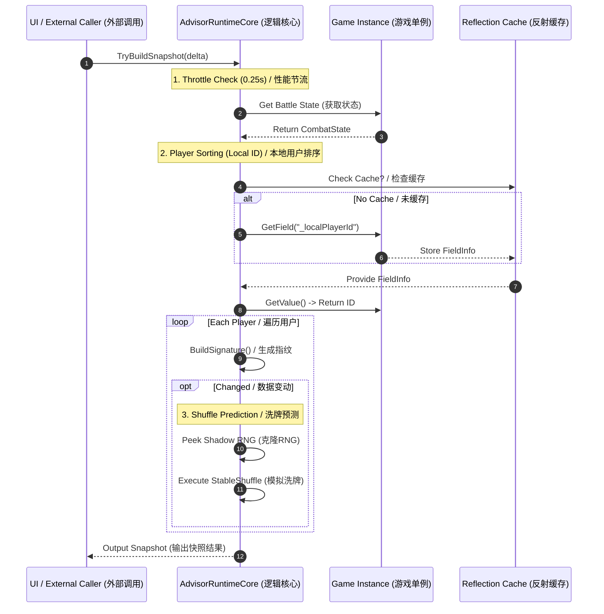

# STS2 Advisor
### 基于反射技术的《杀戮尖塔 2》洗牌预测与战斗增强工具  
### Reflection-based Shuffle Prediction & Combat Enhancement Tool for Slay the Spire 2
---
## 🌟 核心特性 / Key Features
*   **✅ 实时状态监测 / Real-time Status Monitoring**  
    实时追踪牌堆状态，确保数据始终同步。  
    *Monitors draw and discard pile states in real-time to ensure seamless data synchronization.*
*   **✅ 算法精准模拟 / Precise Algorithm Simulation**  
    高精度模拟底层的算法（StableShuffle），实现对顺序的无损预测。  
    *High-fidelity simulation of the game's underlying StableShuffle algorithm for lossless draw order prediction.*

*   **✅ 多人适配 / Multi-player Compatibility**  
    通过反射技术自动识别多人模式下的本地ID，确保逻辑执行的准确性。  
    *Automatically identifies local player IDs in multiplayer mode via reflection, ensuring precise logic execution.*
---
## 🚀 快速上手 / Quick Start
### 环境要求 / Prerequisites
*   **.NET 8.0 SDK**
*   **Godot 4.x Runtime**
### 编译与运行 / Build and Run
执行以下命令进行项目构建：  
*Run the following command to build the project:* dotnet build

🛠️ 设计架构与技术
本项目展示了在受限的单线程环境（Godot）中，如何高效地进行底层数据探测与逻辑模拟。

1. 反射缓存设计 (Reflection Performance Optimization)
为了读取内部私有的 _localPlayerId，项目避免了高能耗的逐帧内存搜索：
缓存策略：引入 FieldInfo 静态缓存。仅在初始化时定位字段偏移量，后续通过指针级的 GetValue 快速提取数据。
安全降级：通过完善的异常处理机制，确保在游戏版本更新导致字段变动时，Mod 能安全失效而不会导致游戏闪退。

2. 状态监测与性能节流 (State Throttling)
通过双重机制确保极致的性能表现：
0.25s 刷新窗口：基于 delta 时间的节流算法，平衡了 UI 实时性与 CPU 占用。
指纹检测 (Data Signature)：为牌堆生成轻量级指纹，只有当数据发生实质性变化时，才触发昂贵的 UI 重绘逻辑。

3. “影子 RNG” 模拟逻辑 (Shadow RNG Simulation)
项目实现了对游戏随机性序列的“无损预测”：
隔离性：通过克隆游戏当前的 Rng 种子与计数器（Counter），在独立的影子实例中运行预测。
算法还原：100% 还原了游戏原生的 Fisher–Yates 乱序算法（StableShuffle），实现精准预测且不污染游戏的原始随机序列。
