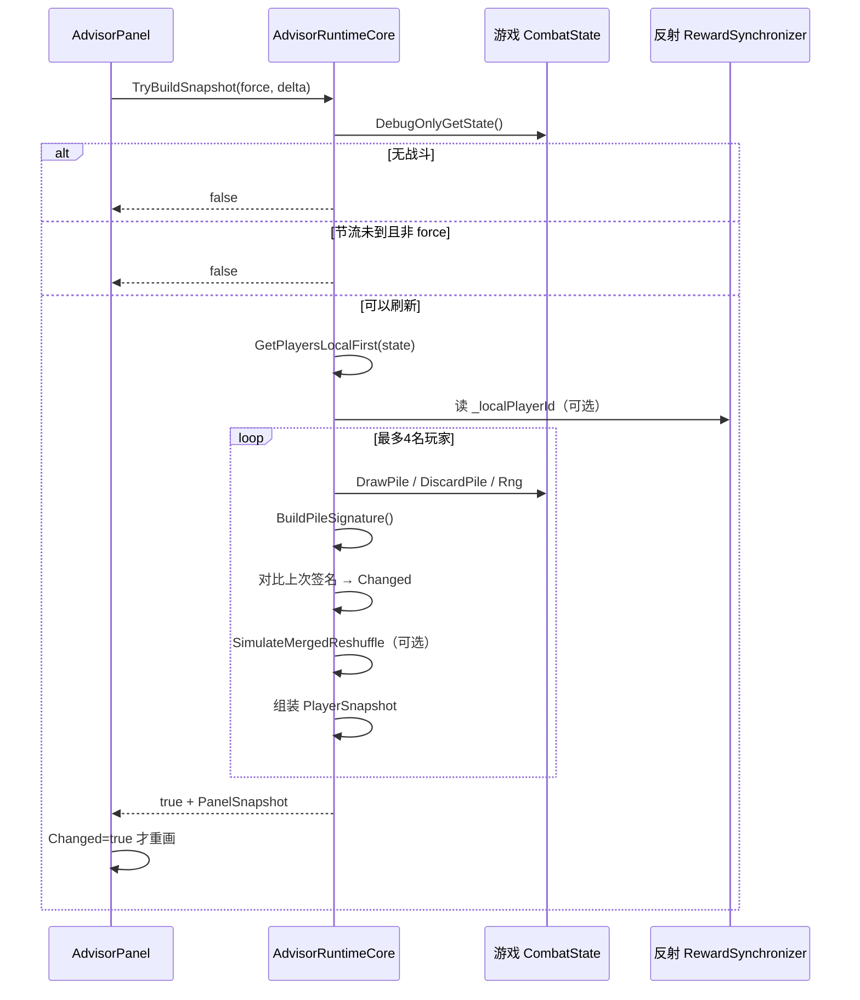
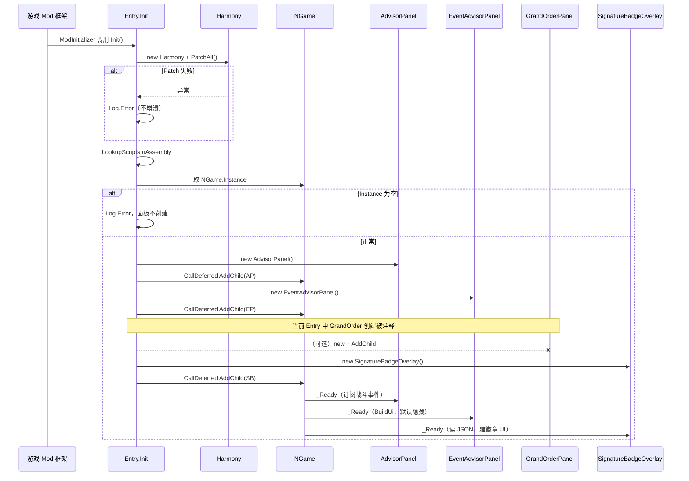
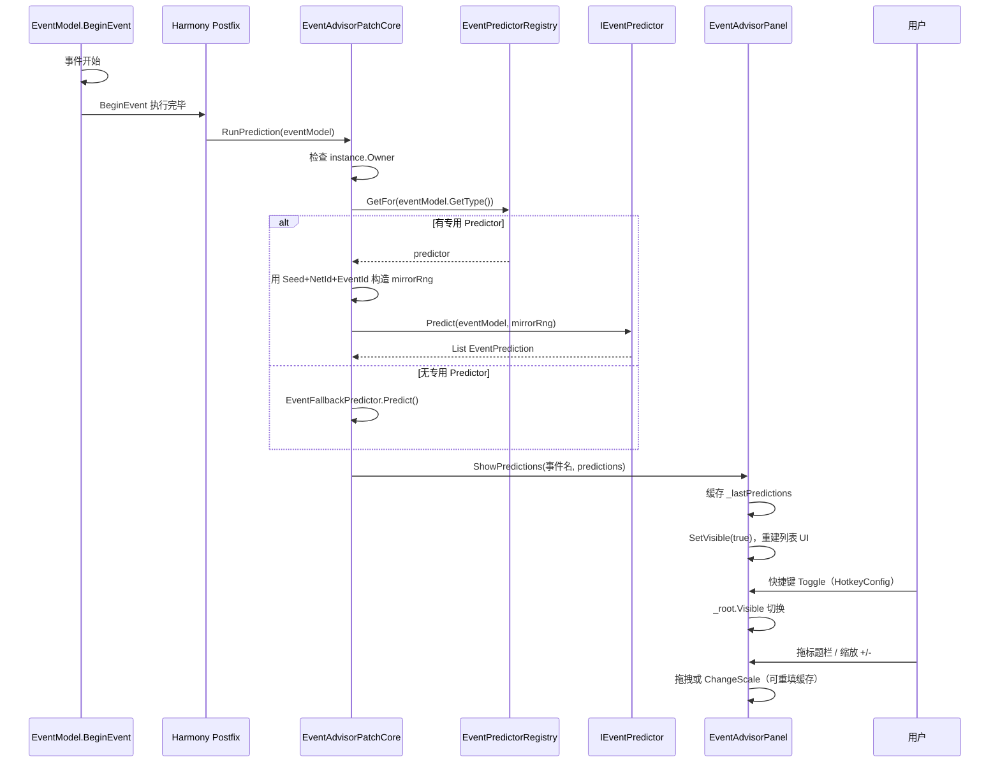
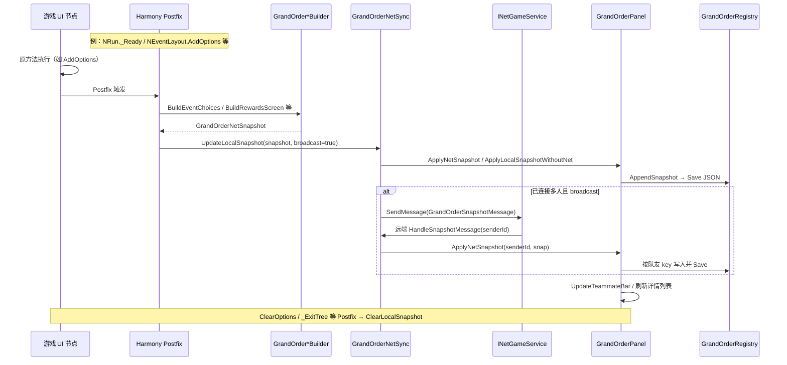
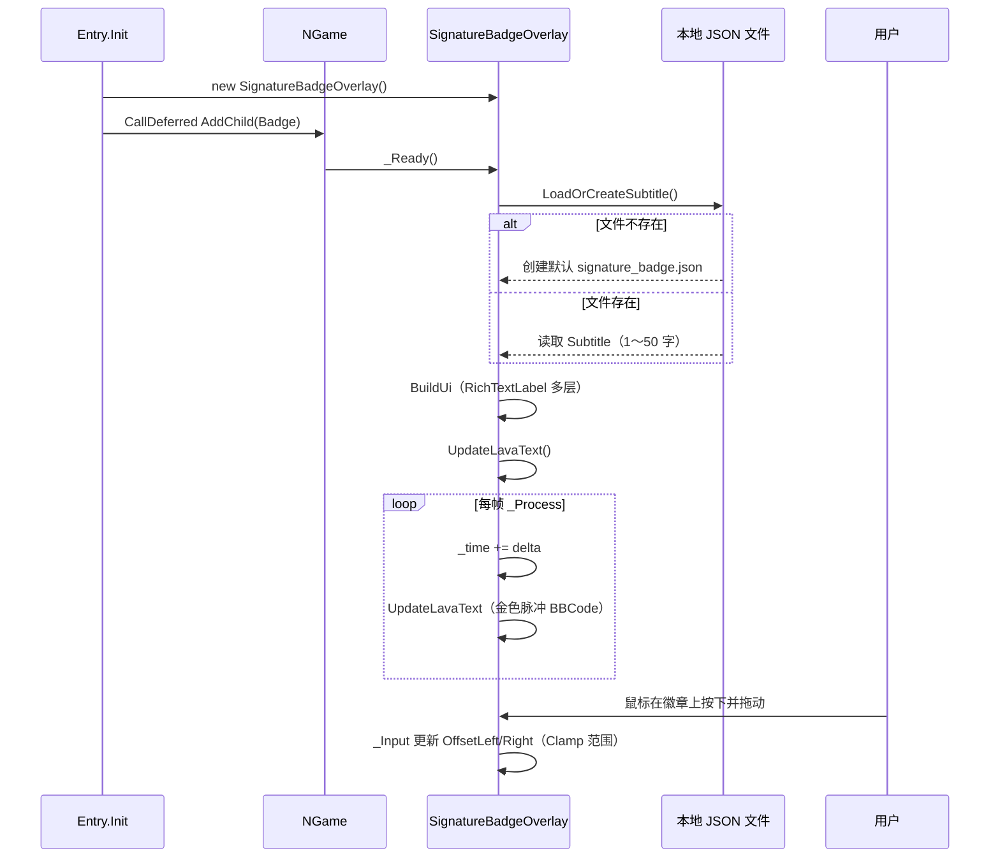

# STS2Advisor 项目介绍

## 项目定位

Slay the Spire 2 的 C# mod：在**不破坏游戏主流程**的前提下，对战斗与事件相关的运行时状态做**只读观测**，经 Godot UI 展示；部分模块会做结果预测。

因游戏无完整公开 API，开发流程为：**ILSpy 反编译游戏程序集 → 理解类型与调用链 → 选用公开接口 / Harmony 插桩 / 反射 → 编译 DLL 挂入游戏进程**。

---

## 分层架构

| 层级 | 文件 | 职责 | 与信息安全相通的点 |
|------|------|------|-------------------|
| 入口层 | `Entry.cs` | Harmony 插桩、挂载 UI、异常降级 | 宿主集成、API Hook、fail-safe |
| 运行核心 | `AdvisorRuntimeCore.cs` | 采集状态、签名比对、洗牌预测、输出快照 | 状态观测、反射、指纹/基线、只读分析 |
| 展示层 | `AdvisorPanel.cs` | 订阅事件、节流刷新、仅重绘变化项 | 职责分离、可审计边界 |
| 扩展 | Patch / Predictor / 网络消息 | 规则推演、协议编解码 | 运行期改写、接口版本兼容 |

---

## 核心刷新流程（时序图）

下图描述 `AdvisorPanel` 与 `AdvisorRuntimeCore` 一次完整刷新的调用关系：

---

## Entry 入口与各 Panel 挂载（总览）

`Entry.Init` 在 Harmony 打补丁后，把多个 `CanvasLayer` 挂到 `NGame` 上（`CallDeferred` 避免生命周期时机问题）。

> **说明**：当前代码里 `GrandOrderPanel` 的创建被注释掉了，但 Harmony Patch + `GrandOrderNetSync` 逻辑仍在；若未挂载 Panel，`GrandOrderPanel.Instance` 为 null，网络快照只会走发送、不会更新 UI。

---

## EventAdvisorPanel（天堂之眼）流程

事件开始时由 Harmony **Postfix** 触发预测，结果推送到面板；用户用快捷键切换显示。

---

## GrandOrderPanel（队友选项观测）流程

由 Harmony 在事件/奖励/商店等 UI 生命周期 **Postfix** 采集选项快照，经 `GrandOrderNetSync` 写本地并可选广播；Panel 负责展示与持久化。

---

## SignatureBadgeOverlay（签名徽章）流程

常驻屏幕的装饰层：启动时读 JSON 配置，每帧更新动画；支持横向拖拽。

---

## 面试口述稿（约 7～8 分钟）

> 正常语速、适当停顿；技术名词可略放慢。全文约 2200 字。

---

**【开场：项目是什么 + 规模 + 开发方法】**

您好，我想重点介绍一个我自己做的项目：Slay the Spire 2 的 C# mod，名字叫 STS2Advisor。

它的整体目标，是在**不破坏游戏主流程**的前提下，对战斗和事件相关的运行时状态做**只读观测**，再通过 Godot UI 展示；部分模块还会根据游戏规则做**结果预测**。manifest 里我也明确写了 `affects_gameplay: false`，设计意图是辅助分析，而不是改游戏数值或作弊。

这个项目规模不算小：Scripts 目录下有六十多个 C# 文件，其中包括核心的牌堆面板、四十多个事件 Predictor、Harmony Patch 模块，以及多人同步相关的网络消息实现。

因为游戏**没有完整公开的 mod API 文档**，我的开发流程基本是：先用 **ILSpy** 打开游戏的 `sts2.dll`，从入口类和 mod 加载机制看起，顺着类型引用找 `CombatState`、`Player`、`CardPile`、`INetMessage` 这些关键类型；确认哪些成员是 public、哪些只能反射；再在本地写 C# 引用同一份 DLL 编译，最后把产物复制到游戏的 mods 目录里运行验证。这个过程和安全领域里**分析闭源组件、做集成对接**非常像——不是凭猜测写代码，而是**先理解目标程序的结构，再选最小侵入的接入方式**。

---

**【第一层：入口与宿主集成 — Entry.cs】**

第一层是**入口层**，对应 `Entry.cs`。游戏加载 mod 时会调用 `[ModInitializer]` 标记的 `Init` 方法。

这里我主要做三件事。

**第一，Harmony 运行期插桩。** 我创建 `Harmony` 实例并 `PatchAll`，扫描程序集里所有带 `[HarmonyPatch]` 的类，在目标方法前后插入逻辑。比如 Grand Order 相关模块会在 `NRun._Ready`、`NEventLayout.AddOptions`、`NRewardsScreen.UpdateScreenState` 等生命周期钩子上挂代码。这和安全产品里的 **API Hook、运行期行为拦截** 是同一类底层思路：都是在**不修改原 EXE 源码**的情况下，改变或观测已有程序的行为。区别只在于用途——我是做功能扩展和状态采集，安全软件可能是做检测或策略执行。

**第二，fail-safe 降级。** `PatchAll` 包在 try/catch 里，失败只打 `Log.Error`，不让整个 mod 加载崩溃。因为 mod 是 DLL 注入到宿主进程里的，一旦未处理异常向上冒泡，可能拖垮整个游戏。这和安全 Agent 的**故障隔离**一样：探针挂了，主业务尽量还能跑。

**第三，UI 挂载。** 创建 `AdvisorPanel`、`EventAdvisorPanel`、`SignatureBadgeOverlay` 等 Godot 节点，通过 `CallDeferred` 挂到 `NGame.Instance` 上，避免在错误的生命周期时机改场景树。这一层解决的是：**怎么进进程、怎么稳定挂载、怎么控制失败面**。

---

**【第二层：运行核心 — AdvisorRuntimeCore.cs】**

第二层是我后来**刻意拆出来的运行核心** `AdvisorRuntimeCore`，和 UI 完全分离。原因是早期 UI 和逻辑混在一起，很难讲清楚、也很难维护；拆分后，Core 只负责**采集、判断、输出快照**，Panel 只负责渲染。

主入口是 `TryBuildSnapshot(force, delta, out snapshot)`，返回 bool，表示这次有没有产出可用快照。流程可以概括成五步。

**第一步，取战斗状态。** 通过 `CombatManager.Instance.DebugOnlyGetState()` 拿到 `CombatState`。注意：`Instance` 是单例，`DebugOnlyGetState()` 返回的是内部的 `_state`，类型是 `CombatState?`。没有战斗就 return false，避免后面空引用——这是典型的**防御式编程**。

**第二步，节流。** 非 force 模式下，累计 delta，未满 0.25 秒不刷新。因为抽牌、弃牌变化不一定触发 UI 事件，需要轮询兜底，但又不能每帧全量重建。这和安全监控里的**采样 + 事件驱动**类似：降低噪声、控制资源开销。

**第三步，玩家排序。** `GetPlayersLocalFirst` 从 `state.Players` 取列表。多人时，公开 API 不一定能直接告诉你“本地玩家是谁”。我用 ILSpy 在 `RewardSynchronizer` 里找到私有字段 `_localPlayerId`，再用反射 `GetField` + `GetValue` 读取，并把 `FieldInfo` **静态缓存**，避免高频反射开销。外面包 try/catch，读不到就按原顺序返回——**兼容降级**。这里我也清楚：**私有字段只是封装，不是安全边界**；能反射读到，说明不能依赖 obscurity。

**第四步，读牌堆 + 状态指纹。** 对每个玩家（最多 4 人），读 `DrawPile.Cards` 和弃牌堆 `PileType.Discard.GetPile(player).Cards`——这些都是游戏公开的只读列表，不必去反射私有 `_cards`。再读 `RunState.Rng.Shuffle`。然后 `BuildPileSignature` 把抽牌堆数量、每张卡的对象哈希、弃牌堆、以及 RNG 的 seed 和 counter 拼成字符串签名，和字典 `_lastPileSignatureByPlayer` 里上次的签名比，得到 `Changed`。只有变了才建议 UI 重绘。这类似安全里的**基线比对、变更检测**：用 fingerprint 回答“状态变没变”，而不是每次全量 diff。

**第五步，洗牌预测 + 输出快照。** 若有 RNG 且牌数大于 0，用 `new Rng(seed, counter)` **克隆**一份 RNG，跑 `SimulateMergedReshuffle`：先合并 discard 和 draw，再按游戏逻辑 StableShuffle + Fisher–Yates，预测“如果现在洗牌顺序会怎样”。**不修改游戏真实 RNG**，尽量只读、最小副作用。最后组装 `PlayerSnapshot` 和 `PanelSnapshot` 返回给 UI。

---

**【第三层：展示层 — AdvisorPanel.cs】**

第三层是 `AdvisorPanel`，Godot 的 `CanvasLayer`。

它在 `_Ready` 里订阅 `CombatStateChanged` 事件，在 `_Process` 里带 delta 调用 Core——**事件驱动 + 定时轮询**两条路并存。收到快照后，**只对 `Changed == true` 的玩家**清空子节点、重建卡牌列表，避免无意义的 UI 销毁和创建。

面板重新打开、缩放重建 UI 时，会先 `_runtime.ResetCache()` 清空签名缓存，再 `force: true` 强制全量刷新，防止“缓存命中导致该刷不刷”。快捷键、拖拽等交互都在这一层，Core 完全不关心 Godot 控件。

这一层体现的是**职责分离**：Core 可单独讲逻辑、以后甚至可以单测；UI 只消费结构化数据，边界清楚。

---

**【扩展层：Patch、Predictor、网络】**

除了牌堆面板，项目还有几块扩展能力。

**Harmony Patch 模块** 分布在多个文件，在事件房间、奖励界面、Run 生命周期等节点挂钩，用于在正确时机刷新预测面板或同步状态——本质是**在宿主生命周期的关键路径上插入观测点**。

**事件 Predictor** 我有四十多个独立文件，每个对应游戏里某一类事件或交互，根据当前 Run 状态、RNG、选项结构推导可能结果。这是**规则推演 + 状态机理解**，和协议解析、策略引擎一样，都是“读输入、按规则算输出”。

**网络层** 里实现了 `GrandOrderSnapshotMessage`，同时实现 `INetMessage` 和 `IPacketSerializable`，自定义 `Serialize` / `Deserialize`，并注册 message handler，用 `senderId` 区分来源。这对应安全开发里的**自定义协议编解码和消息分发**。

我还踩过一个很典型的**接口演进**坑：游戏升级后 `INetMessage` 新增了 `ShouldBuffer` 属性，旧 mod 没实现，加载时直接 `ReflectionTypeLoadException`，整包加载失败。我补齐 `public bool ShouldBuffer => false` 后恢复。这和对接安全 SDK、驱动接口版本升级时的问题是一样的。

---

**【工程实践 + 和安全岗位的关联】**

从工程角度，这个项目让我系统练过：

- **C# / .NET 宿主集成**：DLL 被游戏加载，依赖 `sts2.dll` 编译，处理版本漂移  
- **ILSpy 辅助的逆向理解**：在闭源程序集里找类型、字段、调用链  
- **Harmony 运行期插桩**：Hook 生命周期和业务方法  
- **反射与兼容降级**：读私有字段 + 缓存 + try/catch  
- **状态指纹与变更检测**：签名缓存、ResetCache、Changed 标记  
- **网络消息序列化**：INetMessage 契约、序列化、handler  
- **异常隔离与日志定位**：Patch 失败、mod 加载失败从 godot.log 追根因  

我希望把这些**工程能力**迁移到信息安全开发实习里，比如 Agent 集成、运行期观测、协议处理、版本兼容维护。我也清楚，mod 开发不等于完整的渗透或合规体系——如果贵司给我机会，我愿意在现有动手能力基础上，系统补齐认证授权、安全编码规范、常见漏洞类型这些知识，尽快从“能集成、能观测”走到“懂安全、能防护”。

谢谢，以上是我的项目介绍。

---

**【可选：老板追问时的短答】**

| 问题 | 一句答 |
|------|--------|
| 为什么用 Harmony 不用纯反射？ | Hook 需要在固定生命周期插入逻辑；反射适合读字段，不适合改控制流。 |
| 签名和加密哈希区别？ | 签名是变更检测 fingerprint，不是密码学完整性校验。 |
| 会不会改游戏平衡？ | 设计为只读观测；manifest 声明不影响 gameplay。 |
| ILSpy 看到 private 就能读？ | 能，说明封装≠安全；生产系统不能依赖隐藏实现。 |

---

## 关键词速查（面试前 1 分钟扫一眼）

> 格式：**安全/工程关键字** → 含义 → 在本项目中的对应。不必全背，每类记 2～3 个即可。

### Harmony / Hook

| 关键字 | 含义 | 本项目 |
|--------|------|--------|
| **Prefix** | 原方法**执行前**插入；可 `return false` **跳过原方法** | 未用，但要会讲 |
| **Postfix** | 原方法**执行后**插入；可读改 `__instance` / `__result` | ✅ 主力 `[HarmonyPostfix]` |
| **Transpiler** | 直接改 **IL 指令**；最底层、最难 | 未用 |
| **Finalizer** | Patch 链末尾执行，类似 `finally` | 未用 |
| **HarmonyPatch** | 声明 patch 目标类/方法 | `grand_order_patches.cs` |
| **PatchAll** | 扫描程序集批量打补丁 | `Entry.cs` |
| **API Hook** | 拦截/观测已有 API | Harmony 的安全侧说法 |
| **IL 插桩** | 在 IL 层插代码，不改 exe 源码 | Harmony 原理 |
| **__instance** | 被 patch 对象的 `this` | Postfix 参数 |
| **__result** | 原方法返回值（Postfix 可改） | 口述用 |

### .NET / 反射

| 关键字 | 含义 | 本项目 |
|--------|------|--------|
| **Reflection** | 运行时查类型、读字段/方法 | `_localPlayerId`、`NeowPredictor` |
| **FieldInfo** | 字段元数据；`GetValue` 读值 | `_cachedLocalPlayerIdField` |
| **BindingFlags** | 控制查 public/private 等 | `Instance \| NonPublic` |
| **ReflectionTypeLoadException** | 接口未实现全 → **加载失败** | 缺 `ShouldBuffer` 那次 |
| **Interface Contract** | 实现接口须满足**全部成员** | `INetMessage` |
| **Fail-safe / 降级** | 失败不崩，走备用路径 | `catch { }`、读不到 localId 不排序 |
| **Security through obscurity** | 靠隐藏当安全（错误） | private 仍能被反射读 |

### 逆向 / 分析

| 关键字 | 含义 | 本项目 |
|--------|------|--------|
| **ILSpy** | .NET 反编译器 | 分析 `sts2.dll` |
| **Decompile** | DLL → 可读 C# | 开发前分析 |
| **Call Chain** | 谁调谁 | `CombatManager → CombatState → Players` |
| **Version Drift** | 宿主升级接口/字段变化 | `ShouldBuffer`、字段改名 |

### 宿主集成 / Agent

| 关键字 | 含义 | 本项目 |
|--------|------|--------|
| **Host Process** | 被集成的主程序 | 游戏进程 |
| **DLL / Plugin** | 以 DLL 被宿主加载 | `STS2Advisor.dll` |
| **同进程集成** | 与主程序共享进程 | mod 与游戏同进程 |
| **Probe** | 采集/观测组件 | Postfix、Core 读状态 |
| **Read-only Observation** | 尽量读、少写 | `DrawPile.Cards` |
| **最小副作用** | 不改核心状态 | 克隆 RNG 预测 |

### 状态监控 / 指纹

| 关键字 | 含义 | 本项目 |
|--------|------|--------|
| **Fingerprint** | 短摘要代表复杂状态 | `BuildPileSignature` |
| **Baseline** | 上次已知状态 | `_lastPileSignatureByPlayer` |
| **Change Detection** | 与基线比变没变 | `Changed` |
| **Cache Invalidation** | 强制下次全量比对 | `ResetCache()` |
| **Throttling** | 限制刷新频率 | 0.25 秒节流 |
| **Event-driven** | 有事件才处理 | `CombatStateChanged` |

> **注意**：fingerprint ≠ SHA256 等密码学哈希。

### 网络 / 协议

| 关键字 | 含义 | 本项目 |
|--------|------|--------|
| **Serialize / Deserialize** | 对象 ↔ 包体 | `PacketWriter` / `PacketReader` |
| **INetMessage** | 网络消息契约 | `GrandOrderSnapshotMessage` |
| **Handler** | 消息分发处理 | `RegisterMessageHandler` |
| **senderId** | 发送方标识 | 多人区分来源 |
| **ShouldBroadcast / ShouldBuffer** | 广播/缓冲策略 | 接口属性 |
| **协议演进** | 接口加字段 | `ShouldBuffer` 新增 |

### 日志 / 架构

| 关键字 | 含义 | 本项目 |
|--------|------|--------|
| **Observability** | 可 Log 定位 | `godot.log` |
| **异常隔离** | 异常不拖垮宿主 | try/catch |
| **Separation of Concerns** | 逻辑与 UI 分离 | Core vs Panel |
| **DTO / Snapshot** | 纯数据结构 | `PlayerSnapshot` |
| **防御式编程** | 先判 null 再访问 | `state == null` return |

### 30 秒应急串词

> 宿主 **DLL 集成**、**ILSpy 反编译**、Harmony **Postfix Hook**、**.NET 反射** 与 **FieldInfo 缓存**、**fail-safe 降级**、状态 **fingerprint** 与 **baseline 变更检测**、**INetMessage 序列化** 与 **handler**、**接口版本漂移** 与 **ReflectionTypeLoadException** 排查、**异常隔离** 与 **可观测性**。

### 最容易卡壳的 5 个（优先记）

1. **Postfix** — 方法执行后 Hook  
2. **Reflection / FieldInfo** — 读私有字段  
3. **Fingerprint / Baseline** — 签名比对是否变化  
4. **Interface Contract** — 缺接口成员 → 加载失败  
5. **Fail-safe / 降级** — 失败不崩，走备用逻辑  
